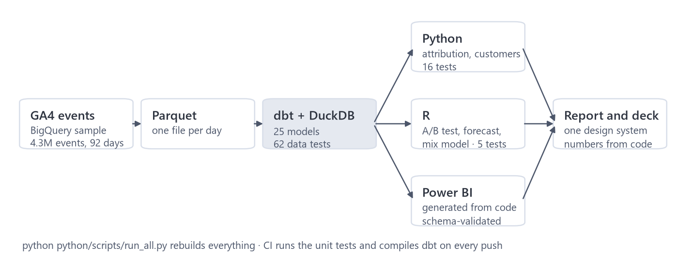

# Merch Store Analytics Review

**Where Google's own online store loses revenue, which channels really drive its sales, and what to test first.** An end-to-end marketing analytics project on 4.3 million real GA4 events: data engineering, data-quality forensics, attribution modelling, funnel and customer analysis, a Power BI dashboard, and a report with a sized test plan.

[](https://github.com/sonny-888/ga4-marketing-analytics/actions/workflows/ci.yml)


[](LICENSE)

*Independent analysis of Google's public GA4 sample (1 Nov 2020 to 31 Jan 2021). Not affiliated with or endorsed by Google.*

| 📄 [Report (PDF)](report/report.pdf) | 📊 [Dashboard (PDF)](dashboard/MarketingAnalytics.pdf) | ⬇️ [Power BI file (.pbix)](https://github.com/sonny-888/ga4-marketing-analytics/releases/latest) | 🖥️ [Slide deck (PDF)](presentation/deck.pdf) | 📓 [Notebooks](notebooks/) |
|---|---|---|---|---|

## The 30-second version

| | Finding | So what |
|---|---|---|
| **30%** | of orders were credited to the store's own website, and three more tracking faults distorted revenue and the funnel | Every report built on the raw data pointed at the wrong channel and the wrong funnel step. All four faults are now detected automatically |
| **74 of 100** | people who view a product leave before the basket, on mobile and desktop alike | The product page is the biggest leak; an A/B test can detect a 10% lift in about 13 days |
| **75%** | of January's 57% drop in revenue per day came from conversion, not traffic | Plan the first quarter on a post-holiday baseline |
| **40–43%** | of sales are credited to Organic Search under all seven attribution models | Protect SEO; don't cut Paid Search on last-click numbers |
| **41%** | of revenue comes from 15% of customers, each from a single shopping trip | Test a second-purchase offer within two weeks of a first order |


## Business impact: from finding to test

Every recommendation is a test sized from the store's own traffic (two arms, 95% confidence, 80% power), not a guess.

| # | Action | Evidence | Success metric | Size and run time |
|---|---|---|---|---|
| 1 | Fix GA4: exclude own domains, send an ID with every purchase, alert on broken tags | 4 faults; 30% of orders mis-credited | Self-referral share near 0%, IDs on 100% of purchases | Verifiable within a week |
| 2 | A/B test the product page, starting with the weak entry pages | View to cart 25.7%; four entry pages bring 29% of visits but 7% of purchases | View-to-cart rate | ~4,700 sessions per arm, ~13 days for a 10% lift |
| 3 | Second-purchase offer within two weeks | 7.5% of customers buy twice; 6 in 10 repeats return within 14 days | 30-day repeat vs a holdout | 2,000 to 3,300 customers per arm, ~3 to 4.5 months |
| 4 | Keep Paid Search until a holdout can run | +23% credit under the data-driven model | Incremental orders | Too small (1.2% of orders) to test on this traffic |
| 5 | Checkout improvements, after the product page | Half of checkouts don't finish | Checkout to purchase | ~49 days even for a 10% lift: test only big changes |

## Data cleaning: the part most projects skip

Before any analysis I checked the raw events. Four faults would have misled every report:

| Fault | What it distorts | Effect if ignored | Fix |
|---|---|---|---|
| Self-referrals | Channel credit | **30%** of orders credited to the store itself | Credit goes to the visits before; journeys with no earlier visit become "Unknown" |
| 906 purchases with no transaction ID | Revenue and orders | **$30.7K** of real orders dropped by the usual dedupe | Same session, amount and basket = one order (837 orders kept) |
| Duplicate purchase events | Revenue | **+7%** revenue | One event per order |
| Add-to-cart tag broken for 22 days | Funnel | View to cart **19.7%** instead of 25.7% | Funnel uses the 70 clean days |
| Order values missing 26 to 31 Jan | January revenue | January looks **−64%** per day instead of −57% | Value comparisons skip those days |

Each fault is flagged automatically in the data model and checked by a data test. Details and the range of reasonable treatments: [docs/data_quality.md](docs/data_quality.md).


## How it was built



| Stage | What I did | Where |
|---|---|---|
| **Extract** | 92 daily GA4 tables from BigQuery to Parquet | `notebooks/01_ga4_extract.ipynb`, `python/scripts/` |
| **Model and clean (SQL)** | 25 dbt models on DuckDB: sessions, deduplicated orders, customers, attribution journeys, tracking-health flags; 62 data tests | `sql/` |
| **Analyse (Python)** | Seven attribution models including a Markov chain with bootstrap intervals; RFM and BG/NBD customer value; funnel, landing-page, basket and cohort analysis | `notebooks/`, `python/marketing_analytics/` |
| **Analyse (R)** | Trends, forecasting chosen by back-tests, an A/B test and a media mix model (on external datasets, clearly labelled) | `r/` |
| **Visualise** | Five-page Power BI dashboard with a documented KPI dictionary; one design system for every chart, page and slide | `dashboard/`, `design/` |
| **Communicate** | Executive and technical report with a sized test plan | `report/` |

Also in the project, as methods demonstrations on public datasets (the GA4 sample has no experiments or ad spend): an [email A/B test](docs/experimentation.md) on 64,000 customers with sample-ratio checks, Holm correction, CUPED and power analysis, and a [Robyn media mix model](docs/mmm.md) with budget reallocation.

## Repository structure

```text
├── report/         report.pdf: the executive and technical report
├── presentation/   deck.pdf: the slide deck
├── dashboard/      dashboard PDF, screenshots, KPI dictionary, all DAX, the generator script (.pbix on the release page)
├── notebooks/      01 extract · 02 attribution · 03 customers · 04 exploratory analysis
├── sql/            dbt project: SQL models, data tests and seeds
├── python/         marketing_analytics/ (reusable code) · scripts/ (pipeline) · tests/
├── r/              trends, A/B test, forecast, media mix model, and unit tests
├── docs/           deep dives: data quality, attribution, customers, analysis, methods, design system
├── figures/        every chart in the report and README
├── design/         tokens.json: the colours and fonts every output uses
└── .github/        CI: unit tests and dbt compile on every push
```

## Reproduce and verify

**Tested with** Python 3.13, dbt-core 1.11 with dbt-duckdb, R 4.5, on Windows 11. To just look at the dashboard, open [`dashboard/MarketingAnalytics.pdf`](dashboard/MarketingAnalytics.pdf), or download `MarketingAnalytics.pbix` from the [latest release](https://github.com/sonny-888/ga4-marketing-analytics/releases/latest) and open it in Power BI Desktop; the data is included.

```bash
python -m venv .venv
.venv\Scripts\activate
pip install -e ".[extract,dev,mmm]"
```

1. **Get the data** (free BigQuery sandbox, your own Google account): set `GCP_PROJECT` in `notebooks/01_ga4_extract.ipynb` to your sandbox project ID and run it. Sign-in happens in the browser; no credentials are stored.
2. **Build everything:** `python python/scripts/run_all.py` (about eight minutes; add `--skip-r` without R). It runs the unit tests, the dbt models and data tests, the dashboard generator, the notebooks and the R analyses, then prints every headline number.

| Claim | Command | Expected |
|---|---|---|
| Cleaning and modelling are correct | `cd sql` then `dbt build --profiles-dir .` | 62 data tests pass |
| Python logic is correct (Markov, intervals, lift, test sizes) | `pytest -q` | 16 passed |
| R A/B-test functions are correct | `Rscript -e "testthat::test_dir('r/tests')"` | 5 tests, 9 checks pass |
| Dashboard files are valid and every measure exists | `python dashboard/build_pbip.py --validate` | 0 errors |
| Every number in the report comes from the data | `python python/scripts/headline_facts.py` | matches `report/report.pdf` |

R packages: `ggplot2 scales gt ragg systemfonts jsonlite duckdb DBI dplyr tidyr ggrepel patchwork fable fabletools tsibble feasts urca Robyn reticulate testthat`.

## Limits

Three months with the holidays in the middle; users are browsers, not people; about 9% of traffic sources are hidden by Google; and the email test and media mix model use other datasets, so their numbers illustrate methods, not this store.

## Skills demonstrated

- **SQL and data engineering:** BigQuery extract, 25 dbt models on DuckDB, sessionisation, deduplication, 62 automated data tests, a one-command pipeline
- **Data cleaning and quality:** found four tracking faults, measured how much each changes the answers, and flagged them automatically
- **Python:** Markov-chain attribution with bootstrap intervals, BG/NBD lifetime value, Wilson intervals, basket lift, power analysis
- **R:** A/B testing (sample ratio check, Holm correction, CUPED), forecasting with rolling back-tests, Robyn media mix modelling
- **Power BI:** five-page dashboard, star-schema model, 139 DAX measures, a documented KPI dictionary, built and validated from code
- **Business communication:** findings tied to evidence, uncertainty stated, recommendations written as sized tests
- **Engineering practice:** Git, CI on GitHub Actions, unit tests in Python and R, one design system across outputs

## Data sources

- Google Analytics 4 sample e-commerce dataset, `bigquery-public-data.ga4_obfuscated_sample_ecommerce`
- Kevin Hillstrom, MineThatData E-Mail Analytics and Data Mining Challenge (2008)
- Meta Robyn example data (simulated), from the Robyn R package

## Author

**Sharath Sista**
Data Analyst

[](https://github.com/sonny-888)
[](https://www.linkedin.com/in/sharath-chandra-2bb604377/)

## License

The code is licensed under the [MIT License](LICENSE). The data belongs to its publishers and keeps their terms.
