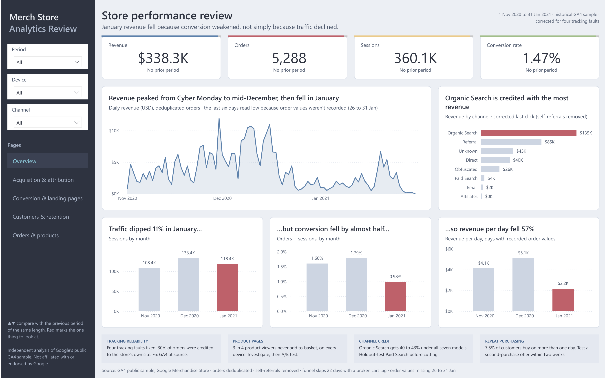
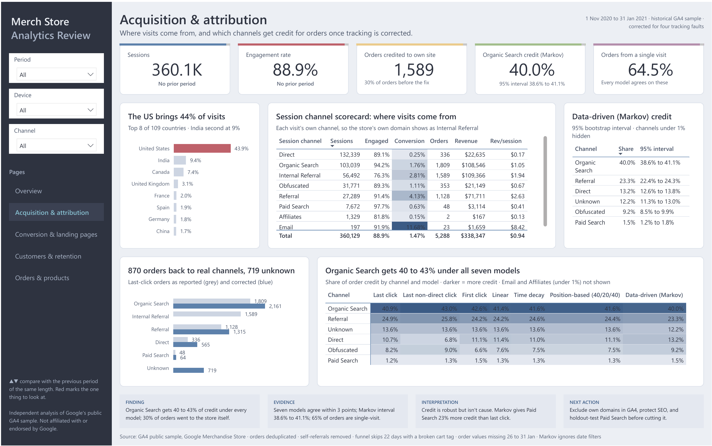
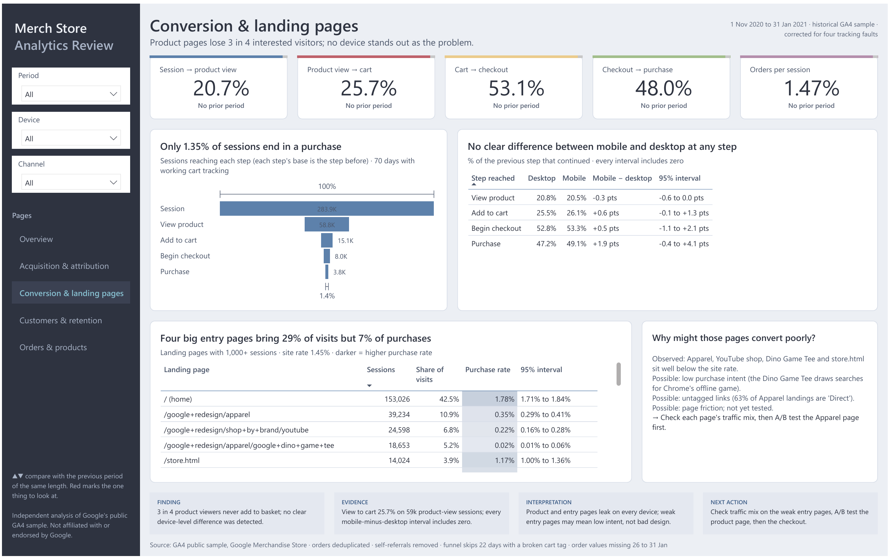
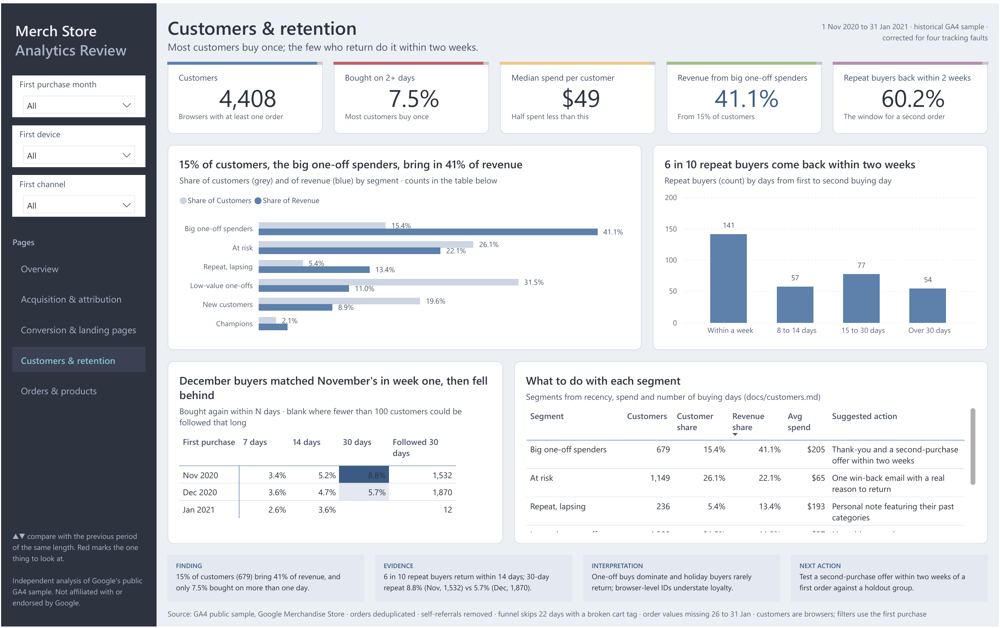
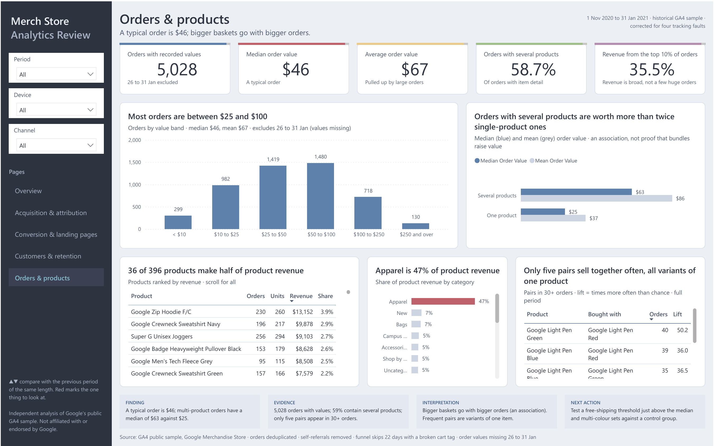

# Power BI dashboard

A five-page report that answers one question per page and ends every page with a decision. Every metric is defined in the [KPI dictionary](KPI_DICTIONARY.md), with its exact DAX.

| | |
|---|---|
| **Files** | [`MarketingAnalytics.pdf`](MarketingAnalytics.pdf) to view it anywhere; `MarketingAnalytics.pbix` on the [latest release](https://github.com/sonny-888/ga4-marketing-analytics/releases/latest) (data included, so it opens in Power BI Desktop without the pipeline; 28 MB, too big to keep in the repo) |
| **Data** | GA4 public sample, Google Merchandise Store, 1 Nov 2020 to 31 Jan 2021, corrected for four tracking faults |
| **Model** | Star schema: 12 data tables plus a measures table, 14 relationships, 139 DAX measures |
| **Built** | From code: [`build_pbip.py`](build_pbip.py) writes the model, pages and theme, then validates them against Microsoft's schemas |

## The pages



| Page | Question it answers | Dominant visual | Supporting evidence | Decision it supports |
|---|---|---|---|---|
| **Overview** | How is the business doing, and why did January drop? | Daily revenue | Credited revenue by channel; sessions, conversion and revenue per day by month | Plan Q1 on a post-holiday baseline |
| **Acquisition & attribution** | Where do visits come from, and who gets credit for orders? | Top-8 country bars and session-channel scorecard | Order credit as reported vs corrected; seven-model heatmap; Markov shares with 95% intervals | Protect SEO; don't cut Paid Search on last-click numbers |
| **Conversion & landing pages** | Where does the journey lose buyers? | Funnel, and mobile vs desktop with 95% intervals | Landing pages with Wilson intervals; possible explanations kept apart from observations | A/B test the product page first |
| **Customers & retention** | Who buys, and do they come back? | Segment share of customers vs revenue | Time to second purchase; 7/14/30-day cohort grid with eligible counts; segment actions | Test a second-purchase offer within two weeks |
| **Orders & products** | What's in an order, and which products matter? | Order value bands | One vs several products; product and category concentration; products bought together | Test a free-shipping threshold and multi-colour sets |

<details><summary>Screenshots of the other four pages</summary>






</details>

Every page has the same frame: a dark slate sidebar with three filters (period, device, channel) and page buttons; a title with the one-line finding; a row of KPI cards; the evidence; and a strip at the bottom with **finding, evidence, interpretation and next action**.

## Headline KPIs

| KPI | Value (full period) | Definition |
|---|---:|---|
| Revenue | $338.3K | Deduplicated order revenue |
| Orders | 5,288 | Deduplicated orders |
| Conversion rate | 1.47% | Orders ÷ sessions |
| Product view to cart | 25.7% | The biggest leak; days with working cart tracking |
| Organic Search credit | 40.0% (95% interval 38.6% to 41.1%) | Data-driven (Markov) share |
| Repeat buyers back within two weeks | 60% | Of customers who bought on 2+ days |
| Median order value | $46 | Days with recorded order values |

When a month is picked in the Period filter, every KPI also shows ▲ or ▼ against the previous period of the same length, in green or red.

## Data model

```text
                 dim_date (92 days, with tracking-health flags)
                    │
   fct_sessions ────┼──── fct_orders ──── dim_channel (12)
   360,129 rows     │     5,288 rows  ──── dim_device (3)
                    │
   fct_order_items  fct_attribution_credits ──── dim_attribution_model (7)
   14,917 rows      41,991 rows (order × visit × model)
                    │
   dim_customers ───┘ (4,408; joined on first purchase date, channel and device)
   attribution_markov (one row per channel)    mart_product_pairs (pairs in 30+ orders)
   dim_funnel_stage (5 steps, drives the funnel visuals)
```

Facts filter through shared dimensions only, so there are no ambiguous paths. All measures live in one `_Measures` table, grouped into folders (Traffic, Sales, Funnel, Attribution, Customers, Products, Period comparison, Formatting).

## How data quality is handled on the dashboard

| Issue | What the dashboard does |
|---|---|
| Add-to-cart tag broken on 22 November days | Funnel measures filter to `dim_date[is_cart_tracking_ok]`, and the funnel subtitles say so |
| Order values missing 26 to 31 January | Order-value and revenue-per-day measures filter to `dim_date[is_revenue_tracking_ok]` |
| Self-referrals (30% of orders) | The session scorecard shows them as "Internal Referral"; order-credit visuals use corrected attribution, with "Unknown" for journeys that have no earlier visit. Titles say which definition each visual uses |
| Two meanings of "conversion" | The KPI is labelled "orders per session" (1.47%); the funnel counts sessions with a purchase (1.35%) |
| Small samples | Landing pages under 1,000 sessions are grouped; cohort cells need 100+ eligible customers; rates show 95% intervals |
| Markov model covers the full period | Footnote on the page: date filters don't apply to it |

## Design decisions

- **One design system.** Colours and fonts come from [`design/tokens.json`](../design/tokens.json), the same file that styles the Python and R charts, the report and the slides. The theme ([`theme.json`](theme.json)) is generated from it.
- **Colour has a job.** A Nordic palette: cool greys and a slate sidebar carry the interface, steel blue (#5E81AC) carries the data, one aurora red (#BF616A) marks the one thing to look at, and green and red arrows appear only for good and bad change, always with words, never colour alone.
- **Hierarchy.** Title states the finding; one row of KPI cards; one dominant visual; supporting evidence below; decision strip last. The layout is a 12-column grid on a 1440 × 900 canvas with 8-point spacing.
- **Chart choices.** Sorted bars for ranking, lines for time, a heatmap for model comparison, tables with intervals where precision matters. No gauges, 3D or decorative doughnuts.
- **Uncertainty is visible.** Intervals and sample sizes sit next to the rates they qualify, and "no clear difference" is used instead of "no difference".
- **Accessible.** Text contrast is at least 4.5 : 1, every visual has alt text, and meaning never depends on colour alone.

Full rules: [`docs/design_system.md`](../docs/design_system.md). A dark one-page overview is also available as an optional alternative view of the same model.

## Rebuilding it

With the data downloaded and the pipeline run (see the main README):

```bash
python dashboard/build_pbip.py --validate
```

This regenerates the Power BI project, the theme, [`measures.dax`](measures.dax) and the [KPI dictionary](KPI_DICTIONARY.md), and checks every file against Microsoft's schemas and every measure reference against the model. Open the generated `MarketingAnalytics.pbip` in Power BI Desktop and click Refresh.
