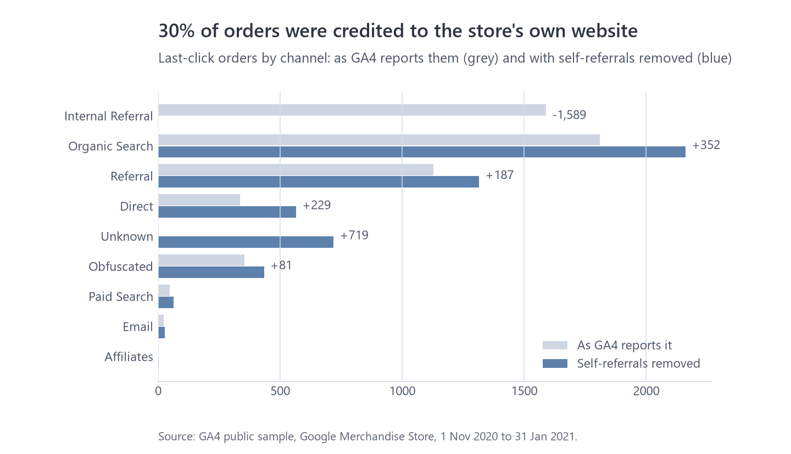
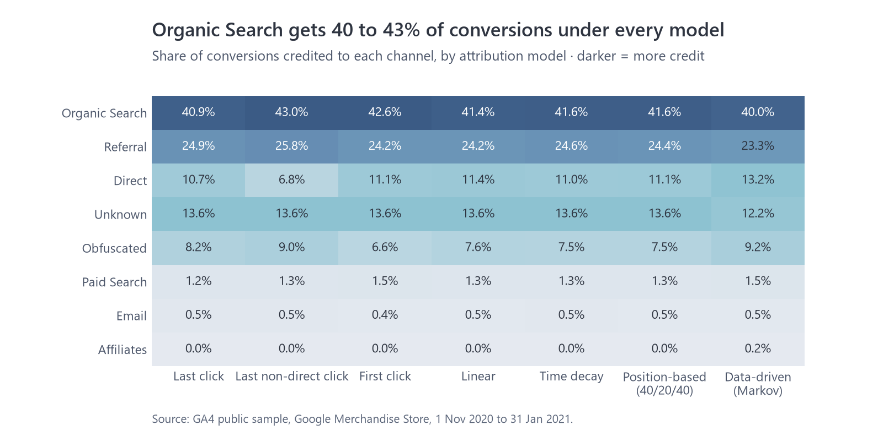
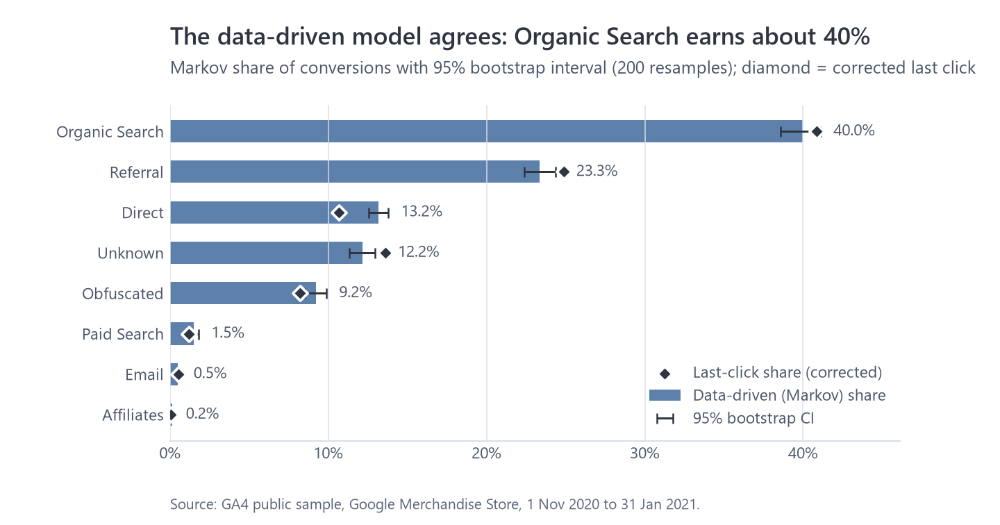

# Which channels drive purchases?

Data: GA4 public sample for the Google Merchandise Store, 1 Nov 2020 to 31 Jan 2021. 5,288 deduplicated orders, $338.3k revenue, 273,232 customer journeys.
Code: `sql/models/intermediate/int_attribution__*`, `sql/models/marts/*attribution*`, `python/marketing_analytics/attribution.py`, `notebooks/02_attribution.ipynb`.

## Summary

The biggest attribution problem in this data wasn't the choice of model. It was a tracking issue. Out of the box, 30% of orders (1,589) are last-click credited to the store's own website, because customers who go to the payment page and come back start a new session. Once those self-referrals are removed, Organic Search is clearly the most important channel, at around 40% of conversions whichever of the seven models you use.

Paid Search and Affiliates get more credit from the data-driven model than from last click, because they tend to start journeys that other channels finish. Before cutting either of them on last-click numbers, it's worth testing properly.

Two thirds of orders (65%) come from a single visit, and every model agrees on those. So the model choice only really matters for about a third of orders.

## 1. Self-referrals

GA4 has a setting (the unwanted referrals list) that stops your own domains starting new sessions. This property doesn't use it. I applied the same logic in the pipeline: sessions referred by the store's own domain are taken out of each journey, and the credit goes to the visits before them. If a journey has nothing but self-referrals, usually because the earlier visit fell before the data starts, it's kept and labelled **Unknown**: the customer came back from the payment page, but where they first came from isn't in the data. That's 719 orders (13.6%). An earlier version labelled them Direct, which made Direct look four times bigger than it is.

| Channel | Last click as GA4 reports it | Last click, self-referrals removed | Change |
|---|---:|---:|---:|
| Internal Referral | 1,589 | 0 | -1,589 |
| Organic Search | 1,809 | 2,161 | +352 (+19%) |
| Referral | 1,128 | 1,315 | +187 (+17%) |
| Direct | 336 | 565 | +229 (+68%) |
| Unknown | 0 | 719 | +719 |
| Obfuscated | 353 | 434 | +81 |

Recommendation: add the store and payment domains to GA4's unwanted referrals list. Until then, every channel report understates Organic Search and Referral by nearly a fifth.

## 2. Seven models side by side

| Model | How credit is split |
|---|---|
| Last click | All to the final visit before the purchase |
| Last non-direct click | All to the final visit that wasn't Direct (the old Google Analytics default) |
| First click | All to the first visit in the 30-day window |
| Linear | Equally across every visit |
| Time decay | Halves for every 7 days before the purchase |
| Position-based | 40% first, 40% last, 20% shared by the visits in between |
| Data-driven (Markov) | Learned from all 273k journeys, including the ones that didn't convert |

Organic Search gets between 40.0% and 43.0% of conversions across all seven, and Referral between 23.3% and 25.8%, so decisions about those two don't depend on the model. Direct is the one that moves: 6.8% under last non-direct click, 10.7% under last click and 13.2% under the data-driven model, which suggests a lot of "Direct" buyers are people who first arrived some other way and came back later. Unknown is 13.6% under every rule-based model because those journeys have a single recorded visit.

## 3. The data-driven model

| Channel | Share | 95% interval | vs last click |
|---|---:|---:|---:|
| Organic Search | 40.0% | 38.6% to 41.1% | -2% |
| Referral | 23.3% | 22.4% to 24.3% | -6% |
| Direct | 13.2% | 12.6% to 13.8% | +23% |
| Unknown | 12.2% | 11.3% to 13.0% | -11% |
| Obfuscated | 9.2% | 8.5% to 9.9% | +12% |
| Paid Search | 1.5% | 1.2% to 1.8% | +23% |
| Email | 0.5% | 0.3% to 0.7% | -9% |
| Affiliates | 0.2% | 0.1% to 0.2% | +307% (2 orders to 8) |

How it works: each journey is treated as a chain of steps from "start" through the channels to either a purchase or nothing. The model asks how much the overall chance of a purchase would drop if a channel disappeared (its "removal effect"), and shares the credit out in proportion. The intervals come from re-running it on 200 random resamples of the journeys.

Referral and Email lose a little credit compared with last click because they usually close a journey someone else started. Paid Search, Direct and Affiliates gain because they usually open one or sit in the middle. Judging them on last click alone would cut the channels that bring new people in.

## 4. What this can't tell you

- Credit isn't return on investment. There's no ad spend in this dataset, so this ranks contribution, not value for money. The media mix model adds spend.
- Credit isn't proof of cause. Attribution splits credit between visits that happened; it can't say what would have happened without a channel. That needs a holdout test.
- Users are tracked by browser cookie, so one person on a phone and a laptop looks like two people. That pushes journeys towards looking single-visit.
- 92 days of data with a 30-day lookback, so journeys that began before November are cut short.
- About 9% of traffic sources are hidden by Google in the public sample. They're kept as their own "Obfuscated" group rather than guessed.
- Email (28 last-click orders) and Affiliates (2) are too small to act on, even though their intervals look tight. The intervals only cover sampling noise.

## 5. Method notes

- A journey is a user's visits in the 30 days before an order, starting after their previous order. The visit with the purchase is always included.
- Orders are deduplicated by transaction ID, or by session, amount and basket when the ID is missing. See [data_quality.md](data_quality.md).
- Settings live in `dbt_project.yml`: 30-day lookback, 7-day half-life for time decay, 200 bootstrap runs.
- Automated checks: every order hands out exactly one conversion under each rule-based model; all seven models share out the same total; and six unit tests cover the Markov maths, including one that checks shuffled input gives identical results (`python/tests/test_attribution.py`).
