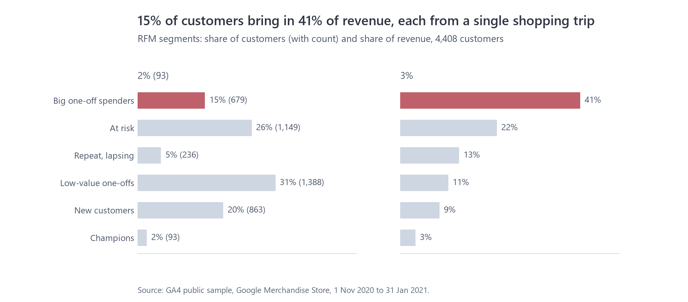
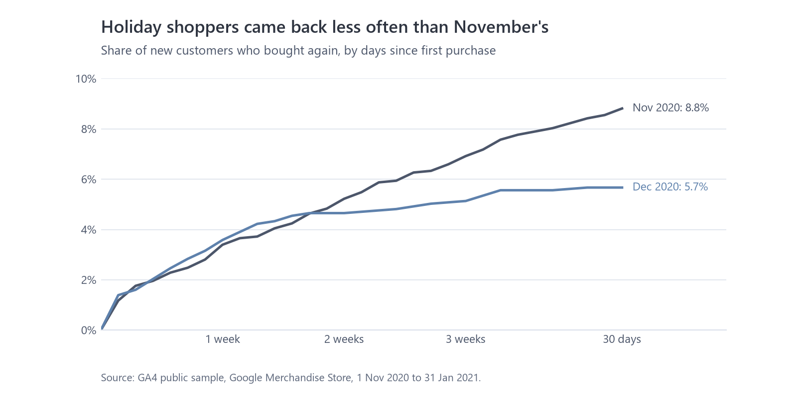
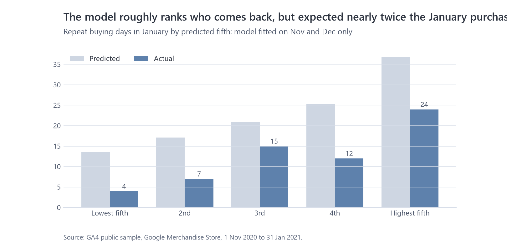

# Customers: who buys, do they come back, and who's worth chasing?

Data: 4,408 customers (browsers with at least one order) from the GA4 sample, Nov 2020 to Jan 2021.
Code: `sql/models/marts/dim_customers.sql` (RFM), `sql/models/marts/customer_clv.py` and `python/marketing_analytics/customers.py` (lifetime value), `notebooks/03_customers.ipynb` (charts).

## Summary

This store lives on one-off purchases. Only 7.5% of customers bought on more than one day in three months, and the median customer spent $49. Value is uneven: 15% of customers, the "big one-off spenders", brought in 41% of revenue in a single shopping trip each. The most useful thing marketing could do here is turn more of those first purchases into a second one.

Timing matters. Customers who first bought in November were more likely to come back within 30 days (8.8%) than December's holiday shoppers (5.7%), which fits gift buying. Where people do come back, it's usually within two weeks.

## Segments

| Segment | Rule | Customers | Revenue | Suggested action |
|---|---|---:|---:|---|
| Big one-off spenders | one buying day, top 20% spend | 15% | 41% | Thank-you plus a second-purchase offer within two weeks |
| At risk | one buying day, bought over 45 days ago, mid-to-high spend | 26% | 22% | One win-back email with a real reason to return, then stop |
| Repeat, lapsing | 2+ buying days, last one over 30 days ago | 5% | 13% | Personal "we've missed you" with their past categories |
| Low-value one-offs | everything else | 31% | 11% | No paid retargeting |
| New customers | one buying day, in the last 30 days | 20% | 9% | Onboarding emails, the main chance to win a second order |
| Champions | 2+ buying days, last one in the last 30 days | 2% | 3% | Early access and loyalty perks |

Frequency counts buying days rather than orders, because two orders on the same day are one shopping trip.

## Do new customers come back?

Both cohorts look the same for the first ten days. After that, November's customers keep returning and December's level off. The practical point is that the window for a second purchase is short: most repeat buyers are back within about two weeks.

## Can we predict who comes back?

I used the BG/NBD model, a standard way to estimate how likely a customer is to still be active and how often they'll buy again. To test it fairly, I fitted it on November and December only and asked it to predict January.

- It expected 114 repeat buying days in January. Only 62 happened. The model assumes people buy at a steady rate, and January was a post-holiday slump, so it overshoots.
- Its ranking is still useful: the fifth of customers it rated highest made 39% of January's repeat purchases, about twice what you'd get picking at random.

So the scores in `marts.customer_clv` are fine for ranking who gets a win-back email, but they shouldn't be read as a revenue forecast.

## Limits

- Three months with the holidays in the middle is a short and unusual window.
- Order values are missing for 26 to 31 January, so about 260 late-January orders count as low spend. That slightly understates spend for customers whose last order fell in those days.
- Customers are browsers. Someone who buys on their phone and later on a laptop counts as two people and looks less loyal than they really are.
- Acquisition channel makes little difference to customer value here (average spend is $71 to $81 for every channel), so the data doesn't support paying more for one channel's customers.
