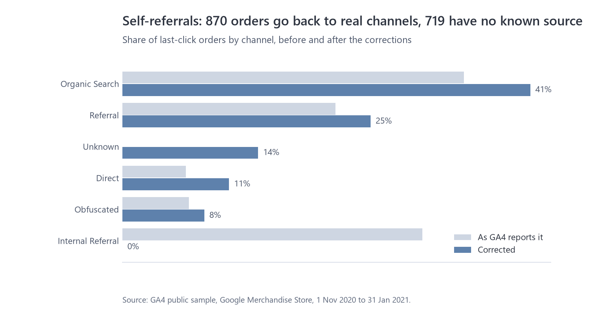
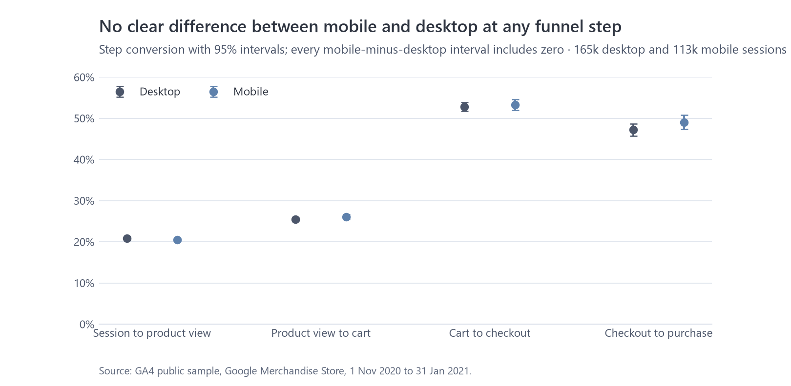
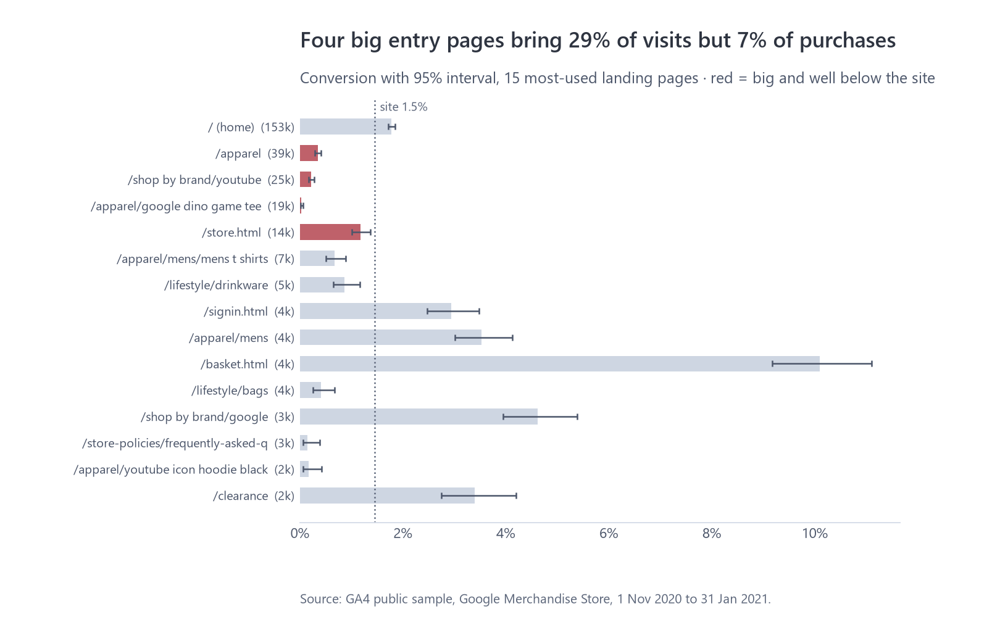
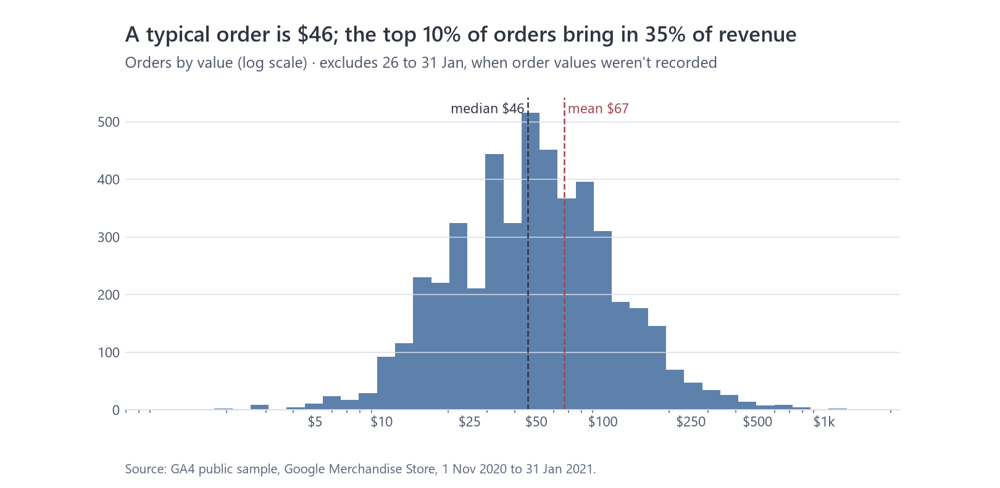
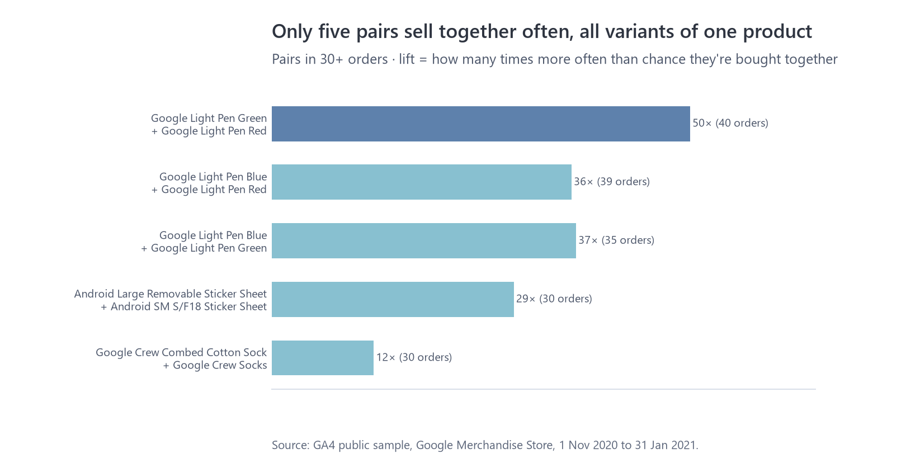
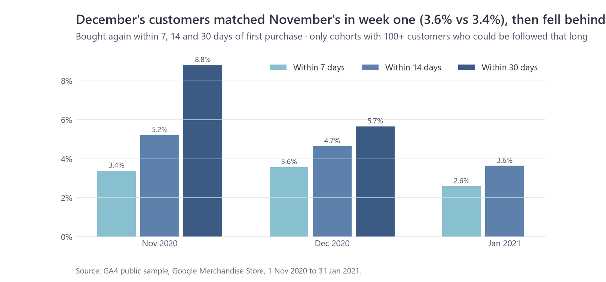

# Exploratory analysis: what else explains revenue?

Code and charts: [`notebooks/04_eda.ipynb`](../notebooks/04_eda.ipynb), with the statistics helpers in `python/marketing_analytics/eda.py` (tested in `python/tests/test_eda.py`).

The other write-ups cover attribution, the funnel and customer segments. This one asks what else in the data explains where revenue is won and lost. Each section follows the same four steps: what the data shows, how much data is behind it, what it does and doesn't mean, and what to do.

## Summary

- **The tracking fixes matter most for channels and the funnel, not for total revenue.** Removing self-referrals hands 870 of the 1,589 self-credited orders (30% of all orders) back to real channels. The other 719 (14%) are journeys whose only recorded visit was a return from the payment page, so their source is labelled Unknown. The broken cart tag made product view to cart look 6 points worse than it is.
- **No clear difference between mobile and desktop was detected at any funnel step** (every interval includes zero), so the checkout problem isn't a mobile problem. I removed "mobile checkout" from the recommendations.
- **Four big entry pages bring 29% of visits but 7% of purchases.** One product page, the Google Dino Game Tee, brought 18,653 visits and 4 purchases.
- **A typical order is $46**, the average $67. The top 10% of orders bring in 35% of revenue, and orders with several products are worth more than twice single-product ones.
- **Apparel is 47% of product revenue**, and 36 of 396 products make half of it. Few products are bought together beyond variants of the same item.
- **December's customers came back as often as November's in their first week (3.6% vs 3.4%), then fell behind** (5.7% vs 8.8% within 30 days).

## 1. How much do the tracking fixes change the answers?

**Observation.** Each headline number as GA4 reports it, after this project's fixes (`data_quality.md`), and, where records are ambiguous, the range of reasonable treatments:

| Number | As reported | Corrected | Change | Range |
|---|---:|---:|---:|---|
| Orders | 5,692 | 5,288 | −7.1% | 4,451 to 5,357 |
| Revenue | $362,165 | $338,347 | −6.6% | $307,640 to $339,457 |
| Average order value | $63.63 | $63.98 | +0.6% | $63.37 to $69.12 |
| Organic Search share of last-click orders | 34.2% | 40.9% | +19% | |
| Direct share of last-click orders | 6.4% | 10.7% | +4.3 pts | |
| Unknown source (returned from payment, no earlier visit) | | 13.6% | | |
| Orders credited to the store's own site | 30.0% | 0% | | |
| Product view to cart | 19.7% | 25.7% | +6.0 pts | |
| Cart to checkout | 73.1% | 53.1% | −20.0 pts | |
| January revenue per day vs December | −64% | −57% | | |

The range comes from the only ambiguous records: 906 purchase events without a transaction ID. The low end treats all of them as duplicates, which is what the usual "dedupe by ID" approach does. The high end counts every one as a separate order. This project's rule (same session, amount and basket = one order) lands near the top: 837 orders.

**Evidence.** Every figure comes from the full data, so these are measurements, not estimates. The one judgement call is the no-ID rule, and the range shows it can move orders by at most 16%.

**Interpretation.** Total revenue and average order value barely change. The 719 Unknown orders come from journeys where the only recorded visit was a return from the payment page, usually because the first visit fell before 1 November. An earlier version labelled them Direct, which made Direct look like 24% of orders instead of 11%. What changes is the story about channels and the funnel. As GA4 reports it, the store's own website looks like the second-biggest channel, and cart to checkout looks healthy while product view to cart looks worse than it is. Each of those would point a team at the wrong problem.

**Action.** Fix the tracking at source (referral exclusions, a transaction ID on every purchase), and alert when a tag's daily volume drops, so these corrections don't have to be rebuilt in every report.

## 2. Does the funnel differ by device?

**Observation.** On the 70 days with working cart tracking, mobile minus desktop at each step:

| Step | Desktop | Mobile | Difference (95% interval) |
|---|---:|---:|---|
| Session to product view | 20.8% | 20.5% | −0.3 pts (−0.6 to 0.0) |
| Product view to cart | 25.5% | 26.1% | +0.6 pts (−0.1 to +1.3) |
| Cart to checkout | 52.8% | 53.3% | +0.5 pts (−1.1 to +2.1) |
| Checkout to purchase | 47.2% | 49.1% | +1.9 pts (−0.4 to +4.1) |

**Evidence.** 165k desktop and 113k mobile sessions; even the smallest step has over 3,000 checkouts per device. Every interval includes zero, and none allows a gap bigger than about 4 points.

**Interpretation.** There's no sign that mobile shoppers struggle more. The checkout loses about half of buyers on every device. A difference could still hide inside a device group (for example, one payment method on one phone), but this data can't see that.

**Action.** Test the product page first and the checkout second, on all devices. My earlier recommendation said "mobile checkout"; it's now "checkout" in the README, report, deck and dashboard.

## 3. Landing pages

**Observation.** 950 distinct landing pages (after merging the store's three home-page addresses and ignoring case and query strings); 23 pages with 1,000+ sessions cover 90% of visits. The site converts 1.45% of sessions with a known landing page. Four big entry pages sit well below that:

| Landing page | Sessions | Conversion | Main channel |
|---|---:|---:|---|
| Apparel category | 39,234 | 0.35% | Direct (63%) |
| YouTube brand shop | 24,598 | 0.22% | Organic Search (37%) |
| Google Dino Game Tee | 18,653 | 0.02% (4 orders) | Organic Search (43%) |
| store.html | 14,024 | 1.17% | Direct (65%) |

Together they bring 29% of visits and 7% of purchases. At the other end, the basket page (10.1%, people coming back to finish an order) and a few category pages such as Men's apparel (3.5%) and Google brand (4.6%) convert well above average.

**Evidence.** Conversion intervals use the Wilson method, and only pages with 1,000+ sessions are ranked, so a small page can't top the list by luck. The four weak pages' intervals all sit below the site rate. 7% of sessions have no landing page and are left out.

**Interpretation.** These pages pull in visitors with little buying intent. The Dino Game Tee is probably found by people searching for Chrome's offline dinosaur game. Direct traffic landing deep on the Apparel page usually means links whose source wasn't tagged (emails, internal Google links, apps), so "Direct" here is partly unknown traffic. Landing page and channel can't tell us why people didn't buy: stock, price or simply curiosity are all possible.

**Action.** Don't judge SEO or the site's conversion by these visitors. Tag campaign links so Direct shrinks, check that the Dino Tee and Apparel pages show stock, prices and a clear next step, and A/B test those pages first because they get the traffic to show a result quickly.

## 4. Order values

**Observation.** 5,028 orders (26 to 31 January left out because their values weren't recorded): median $46, mean $67, middle half between $24 and $83, top 1% above $369. The top 10% of orders bring in 35% of revenue.

| Group | Orders | Median | Mean |
|---|---:|---:|---:|
| One product | 1,945 | $25 | $37 |
| Several products | 3,083 | $63 | $86 |
| First order | 4,184 | $48 | $68 |
| Repeat order | 844 | $42 | $59 |

By channel (corrected last click, 400+ orders each) the medians are close: Organic Search $45, Referral $48, Direct $46, Obfuscated $45.

**Evidence.** Whole population, no sampling. Order value is skewed, so the median describes a typical order better than the mean.

**Interpretation.** Revenue isn't driven by a handful of huge orders; it's broad. The big lever on order value is the number of products in the basket, not the channel the customer came from. Repeat orders are a little smaller than first orders, which fits people coming back for one more item.

**Action.** Test basket-building (free-shipping threshold just above the $46 median, "complete the set" suggestions) rather than channel-specific offers. Report median order value next to the mean in dashboards.

## 5. Products and baskets

**A data check first.** In this sample every product-view and add-to-cart event lists about 11 products rather than the one viewed or added, so these events can't tell which product someone looked at. A product-level "views to cart" funnel would be wrong, so products are judged on purchases only. (Added to `data_quality.md`.)

**Observation.**
- Apparel is 47% of product revenue; the next categories (New, Bags, Campus Collection) are 5 to 7% each.
- 396 products sold; the top 36 (9%) make half of product revenue. The top sellers are hoodies, sweatshirts and joggers.
- 59% of orders contain more than one product, but only five pairs appear together in 30 or more orders, and all five are variants of one item: Google Light Pens in different colours (lift 36 to 50), two Android sticker sheets and two kinds of crew socks.

**Evidence.** 5,286 orders with item detail. Pairs need 30+ shared orders before they're reported, because lift is unstable for rare products.

**Interpretation.** People build baskets from a broad range of products rather than fixed combinations. The strong pairs are customers buying a set (several colours), not two different products that go together, so there's no obvious cross-sell bundle in this data.

**Action.** Sell sets where variants already go together (a three-colour light pen pack, sock bundles) and keep "complete the set" suggestions on those pages. Don't build cross-category bundles on this evidence.

## 6. Repeat purchase by first-purchase month

**Observation.** Share of customers who bought again within 7, 14 and 30 days of their first purchase. A customer only counts for a window if the data runs that long after their first purchase (it ends 31 January), and a cell needs 100+ such customers.

| First purchase | Within 7 days | Within 14 days | Within 30 days |
|---|---:|---:|---:|
| November (1,532) | 3.4% | 5.2% | 8.8% |
| December (1,870) | 3.6% | 4.7% | 5.7% |
| January | 2.6% (731) | 3.6% (384) | too few |

Repeat rates by first channel range from 4.9% (Obfuscated) to 8.7%, with overlapping intervals.

**Evidence.** The November vs December gap at 30 days (8.8% vs 5.7%) is about 3 points with roughly 1,500 to 1,900 customers in each group, well outside chance. The first-week rates are the same.

**Interpretation.** Holiday shoppers start off like anyone else but don't keep coming back, which fits gift buying: the purchase was for someone else. Channel doesn't predict who comes back. January's early numbers are lower, but the post-holiday slump and the short follow-up make them a weak guide.

**Action.** Time the second-purchase offer to the first two weeks, and for December buyers try a different message (something for themselves) and measure it against a holdout.

## Left out on purpose

- **Time of day:** timestamps within each day were randomised in this sample.
- **Product-level funnels:** product events list about 11 products each (see section 5).
- **Session duration:** worked out from timestamps, so it inherits the same doubt; GA4's own engagement time is the safer measure if needed.
- **Correlation matrices:** many of the relationships are mechanical (orders and revenue), and a matrix doesn't answer a business question.
- **Conversion paths:** 65% of orders come from a single visit; path detail is in `attribution.md`.
