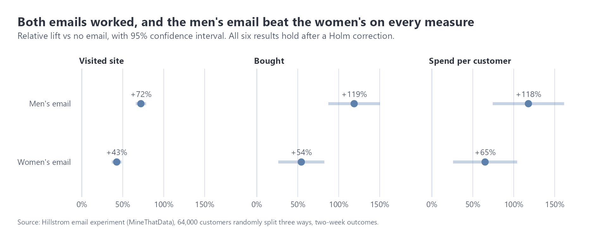
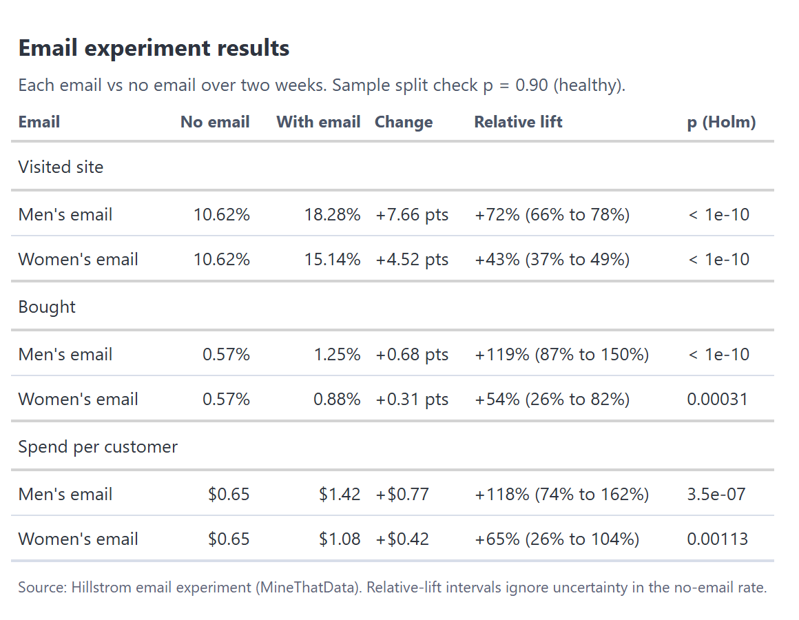
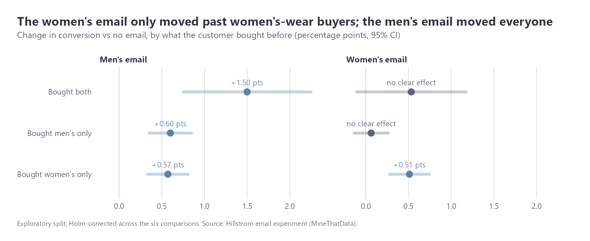
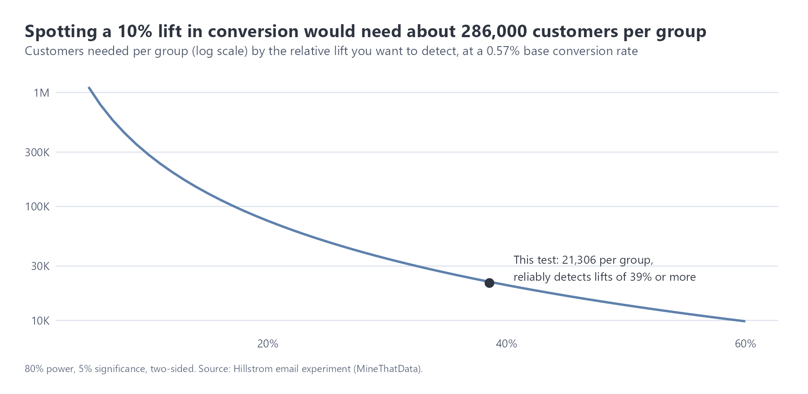

# Email A/B test: does it work, which email, and for whom?

Data: the Hillstrom email experiment (Kevin Hillstrom, MineThatData, 2008). 64,000 past customers were split at random into three groups: a men's merchandise email, a women's merchandise email, or no email. The outcomes are whether they visited the site, bought, and how much they spent over the next two weeks. The GA4 sample has no experiments in it, so this is a separate, real randomised test.
Code: `r/R/abtest.R` (tested functions, `r/tests/test_abtest.R`), `r/ab_test.R` (analysis, charts and tables).

## Summary

Both emails worked, and the men's email was clearly the better one. It more than doubled the chance of a purchase (0.57% to 1.25%) and added $0.77 of spend per customer emailed over two weeks, against $0.42 for the women's email. The more interesting finding is who each email works for: the women's email only moved people who had bought women's clothing before, while the men's email worked across every group. Based on this test, I'd send the men's email to everyone and run a follow-up test to confirm the segment result before acting on it.

## 1. Can we trust the split?

Before looking at any results, I checked that the three groups are the sizes the randomisation intended (a "sample ratio mismatch" check). They are: 21,306 / 21,307 / 21,387, with p = 0.90. If this check fails, nothing else in the test can be trusted.

## 2. Results

I ran six tests (two emails, three measures), so I corrected the p-values for that (Holm method). All six results still hold.

Comparing the two emails directly, the men's email beat the women's on visits (+3.1 points), purchases (+0.37 points) and spend (+$0.35 per customer). The spend difference is the least certain one: anywhere from $0.03 to $0.66.

In money terms, emailing 100,000 customers would bring in roughly $77,000 of extra spend over two weeks with the men's email, or $42,000 with the women's. The dataset doesn't include the cost of sending, so this is extra revenue, not profit.

## 3. Who does each email work for?

Splitting customers by what they'd bought before:

- The **men's email** lifted purchases in all three groups, including people who had only ever bought women's clothing.
- The **women's email** only worked for past women's-wear buyers. For people who had only bought men's clothing, the effect was essentially zero (p = 0.56).

This is exploratory. Splitting results after the fact makes it easier to find patterns by chance, so I corrected for the six comparisons and would still want a follow-up test before changing the targeting.

## 4. Could pre-test data have made the test more precise? (CUPED)

CUPED is a technique big tech companies use to get answers from smaller tests: it removes the part of each customer's result that their past behaviour already predicts. It only helps when past behaviour actually predicts the outcome.

| Measure | Variance removed using past spend | Using all pre-test data |
|---|---:|---:|
| Visited site | 0.4% | 2.7% |
| Bought | 0.1% | 0.2% |
| Spend | 0.05% | 0.1% |

Here it barely helps, because what someone spent over the past year says almost nothing about whether they buy in a given fortnight (correlation 0.02). That's still a useful thing to know: CUPED works well on frequent behaviour like weekly sessions, much less on rare events like purchases.

## 5. How big a test do you need?

With 21,000 customers per group and a 0.57% purchase rate, this test could reliably detect a lift of about 39% or more. The emails had much bigger effects, so that was fine here. But if you wanted to detect a 10% lift, a more typical goal, you'd need about 286,000 customers per group. That's the main reason purchase-rate tests on small lists often come back "inconclusive".

## Recommendations

1. Send the men's email as the default campaign. It worked for everyone and beat the women's email on every measure.
2. Only send the women's email to past women's-wear buyers, and confirm this with a follow-up test that targets by segment from the start.
3. Plan test sizes in advance. For purchase-rate goals, either accept that only big effects can be detected, or test on a more frequent measure (visits) and use CUPED with pre-test visit data.
4. Add the cost per email to the analysis before rolling out, so the decision is based on profit, not just revenue.

## Limits

- The data is from 2008 and from a different retailer than the GA4 store, so the effect sizes are an example of the method, not a forecast for the Google store.
- Two weeks of outcomes only: longer-term effects (unsubscribes, later purchases) aren't measured.
- Spend is mostly zeros with a few large orders, which makes its confidence intervals wide.
