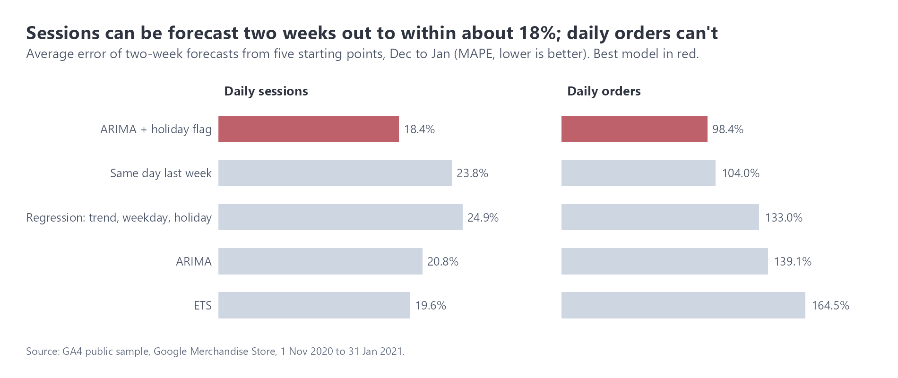
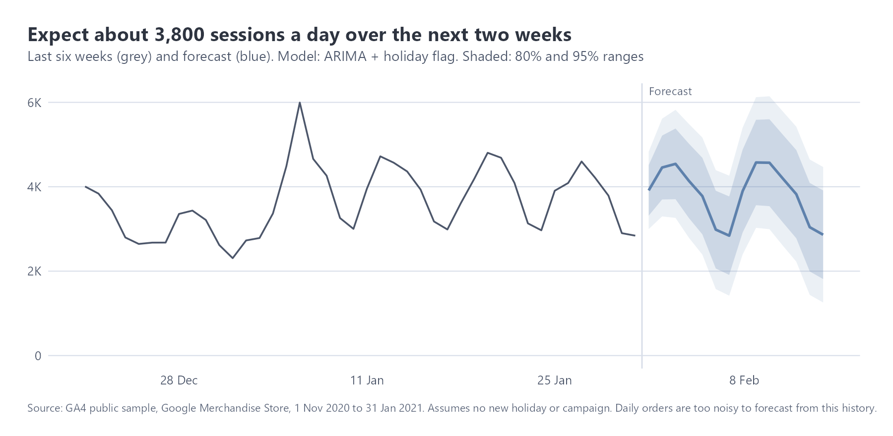

# Forecasting traffic and orders

Data: daily sessions and orders for the GA4 store, 1 Nov 2020 to 31 Jan 2021 (92 days).
Code: `r/forecast.R` (fable). Charts: `figures/forecast/`.

## Summary

Daily sessions can be forecast two weeks ahead with an average error of about 18%, and the next two weeks should average around 3,800 a day, close to late January's level. Daily orders can't be forecast usefully from this history: every model was off by roughly 100% or more. For planning, I'd forecast traffic and apply a conversion rate assumption rather than forecast orders directly.

## How the models were compared

With only 92 days, and the holidays in the middle, it's easy to pick a model that looks good by luck. So each model forecast two weeks ahead from five different starting points across December and January, and I measured the average error (MAPE) on what actually happened. The final forecast goes no further ahead than these tests did.

| Model | Sessions error | Orders error |
|---|---:|---:|
| ARIMA with a holiday flag | 18.4% | 98% |
| ETS | 19.6% | 164% |
| ARIMA | 20.8% | 139% |
| Same day last week | 23.8% | 104% |
| Regression: trend, weekday, holiday | 24.9% | 133% |

The holiday flag helps because it tells the model December was unusual, so it doesn't assume the peak continues. An earlier version of this analysis forecast 30 days ahead after testing only 7 days ahead; the models then carried January's downward slide forward and predicted orders collapsing to 14 a day. Matching the forecast length to the test length fixed that.

## The forecast

About 53,600 sessions over the next 14 days (roughly 3,800 a day), with the usual weekday pattern: higher Tuesday to Thursday, lower at weekends. On any single day, the 80% range is wide (about 1,800 to 5,600), which is honest for a model trained on three months.

## Limits

- 92 days can't show yearly seasonality, so the model doesn't know what a normal February looks like. A year of history would help most.
- The forecast assumes no new campaign, promotion or holiday.
- Order values are missing for 26 to 31 January (see `data_quality.md`), so revenue isn't forecast at all here. Orders and sessions are unaffected.
