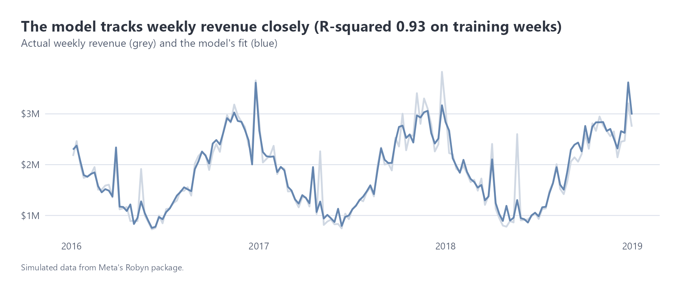
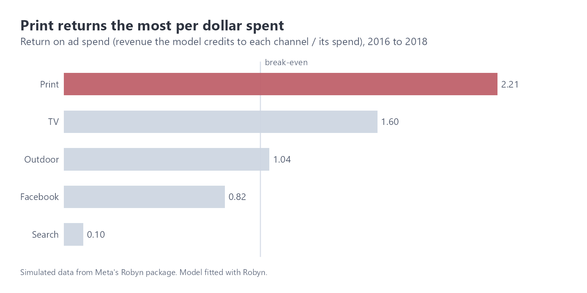
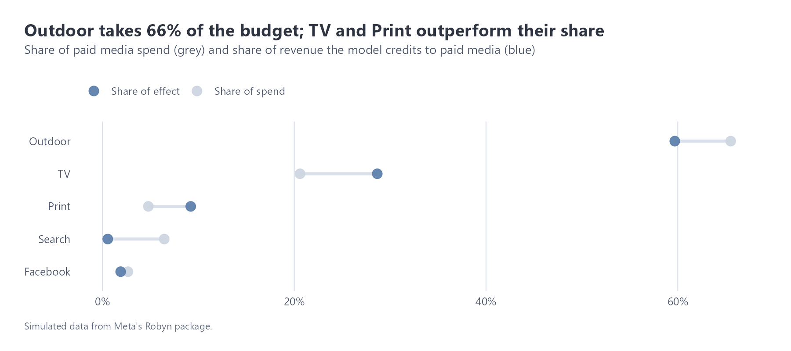
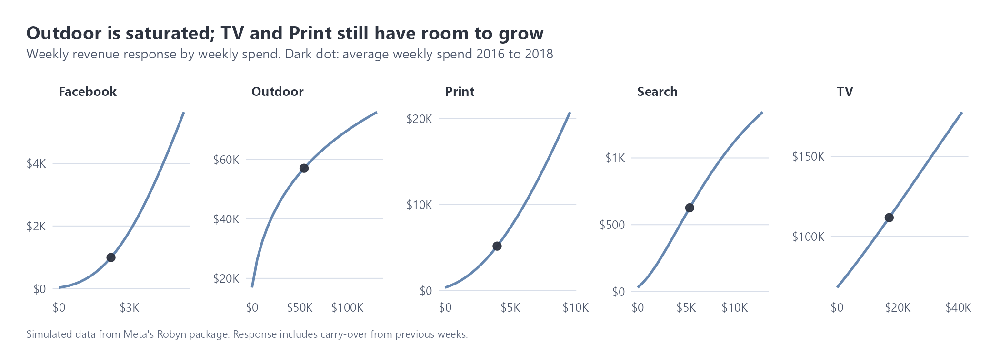
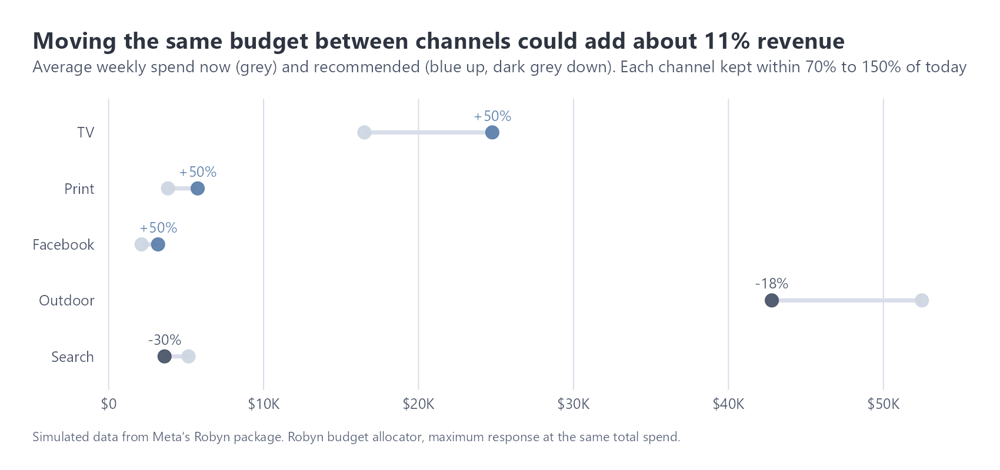

# Marketing mix model: where should the budget go?

Data: Meta Robyn's built-in example dataset. 208 weeks (Nov 2015 to Nov 2019) of **simulated** weekly spend on TV, outdoor, print, Facebook and search, a newsletter, competitor sales, events and revenue. The model uses 2016 to 2018. The GA4 sample has no ad spend, so a marketing mix model can't be built on it; this module shows the method on data designed for it. The numbers describe a made-up business, not the Google store.
Code: `r/mmm.R` (Robyn 3.12). Charts: `figures/mmm/`.

## Summary

Outdoor takes 66% of the budget but is saturated: extra money there buys very little. TV and print return more per dollar and still have room to grow, and search returns about 10 cents per dollar. Keeping total spend the same but moving money from outdoor and search into TV, print and Facebook could lift media-driven revenue by about 11%, according to the model.

## What a marketing mix model does

Attribution (see `attribution.md`) follows individual customer journeys. A marketing mix model works from weekly totals instead: how much was spent on each channel, and what happened to revenue. It doesn't need user-level tracking, so it works for TV and outdoor too, and it isn't affected by cookie loss.

Robyn adds two realistic effects:
- **Carry-over (adstock):** an ad keeps working for a while after it runs. TV usually carries over longest, search the least.
- **Saturation:** each extra dollar buys less once a channel is already busy.

It tries thousands of combinations of these settings (here 5 runs of 2,000) and keeps the models that both fit revenue well and split credit sensibly between channels.

## How good is the model?

| | Training weeks | Validation weeks | Test weeks |
|---|---:|---:|---:|
| R-squared | 0.93 | 0.90 | 0.85 |
| Error (NRMSE) | 0.054 | | 0.112 |

The test weeks matter most because the model never saw them, and it still explains 85% of the movement in revenue. One caution: Robyn's check on how settled the credit split is (DECOMP.RSSD) didn't fully converge, so channel shares could move a little with a longer search.

## Results

| Channel | Share of spend | Share of effect | Return per $1 |
|---|---:|---:|---:|
| Print | 5% | 9% | 2.21 |
| TV | 21% | 29% | 1.60 |
| Outdoor | 66% | 60% | 1.04 |
| Facebook | 3% | 2% | 0.82 |
| Search | 6% | 0.6% | 0.10 |

The response curves show what an extra dollar would do at today's spend (the orange dot). Outdoor is well past the steep part of its curve: an extra dollar there returns about 37 cents. TV and print are still on the steep, straight part, returning about $2.70 and $1.90 per extra dollar. Facebook's curve is still bending upwards, so it looks under-funded rather than saturated, but it's a small channel and the estimate is less certain.

## What to do with the budget

Robyn's budget allocator looked for the best split of the same total weekly spend, keeping each channel between 70% and 150% of today's level so the advice stays realistic:

| Channel | Weekly spend now | Recommended | Change |
|---|---:|---:|---:|
| TV | $16.5K | $24.8K | +50% |
| Print | $3.8K | $5.7K | +50% |
| Facebook | $2.1K | $3.2K | +50% |
| Outdoor | $52.5K | $42.8K | -18% |
| Search | $5.2K | $3.6K | -30% |

Expected result: about 11.5% more revenue from paid media for the same total spend. Three channels hit the +50% limit, which means the model would move even more if allowed. I'd shift money in steps and measure each step rather than trust a larger jump.

## Limits

- The data is simulated, so this demonstrates the method, not real findings.
- A mix model shows correlation over time, not proof of cause. The best practice is to calibrate it with experiments (geo holdouts or lift tests). Robyn supports this, but the example data has no experiment results to use.
- Search may look weak partly because people who already intend to buy are the ones who search. A model can't fully separate that from the ad's own effect. A holdout test would settle it.
- Response curves are least reliable for small channels (Facebook here) and for spend levels the business has never tried.
